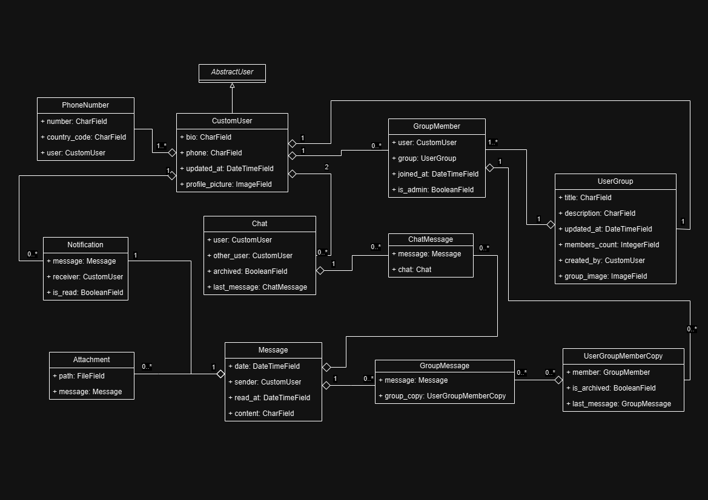

# 📊 BuddyChat API Documentation

## Table of Contents

- [Overview](#overview)
- [Model UML Diagram](#model-uml-diagram)
- [Endpoint](#endpoint)
- [Queries](#queries)
- [Mutations](#mutations)
- [Subscriptions](#subscriptions)
- [Types](#types)
  - [CustomUserType](#customusertype)
  - [PhoneNumberType](#phonenumbertype)
  - [PhoneNumberInputType](#phonenumberinputtype)
  - [MessageType](#messagetype)
  - [ChatType](#chattype)
  - [ChatMessageType](#chatmessagetype)
  - [UserGroupType](#usergrouptype)
  - [GroupMessageType](#groupmessagetype)
  - [GroupMemberType](#groupmembertype)
  - [AttachmentType](#attachmenttype)
  - [NotificationType](#notificationtype)
  - [UserGroupMemberCopyType](#usergroupmembercopytype)
  - [SubsctiptionType](#subsctiptiontype)
- [Mutation Types](#mutation-types)
  - [CreateGroup](#creategroup)
  - [CreateGroupMessage](#creategroupmessage)
  - [CreateGroupMember](#creategroupmember)
  - [ChangeAdmin](#changeadmin)
  - [UpdateGroup](#updategroup)
  - [DeleteGroup](#deletegroup)
  - [UpdateGroupMessage](#updategroupmessage)
  - [DeleteGroupMessage](#deletegroupmessage)
  - [UnsendGroupMessage](#unsendgroupmessage)
  - [RemoveGroupMember](#removegroupmember)
  - [LeaveGroup](#leavegroup)
  - [RemoveGroup](#removegroup)
  - [SetArchiveGroup](#setarchivegroup)
  - [SetNotificationAsRead](#setnotificationasread)
  - [CreateUser](#createuser)
  - [UpdateUser](#updateuser)
  - [ChangePassword](#changepassword)
  - [DeleteUser](#deleteuser)
  - [CreateUserWithPhoneNumber](#createuserwithphonenumber)
  - [AddPhoneNumber](#addphonenumber)
  - [RemovePhoneNumber](#removephonenumber)

## Overview

This is the API documentation for the BuddyChat API. The API is built with Django and GraphQL using graphene. The API introduces a chat system with the following features:

- User registration and authentication
- Chat system
- Group chat system
- Notifications
- Real-time chat messages
- Copy of messages for each user which leads to the ability to delete messages for each user

## Model UML Diagram



## Endpoint

The API endpoint is `/graphql`.

## Queries

- users: The users in the system
- chats: The chats for the current user
- groups: The group copies for the current user
- notifications: The notifications for the current user
- chat: Resolve a chat for the current user
- group: Resolve a group copy for the current user
- user: Resolve a user

## Mutations

- set_notification_read: Set a notification as read
- login: Login to the API. Returns a token
- refresh_token: Refresh the token
- verify_token: Verify the token
- revoke_token: Revoke the token
- create_user: Create a user with a phone number
- add_phone_number: Add a phone number to the current user
- remove_phone_number: Remove a phone number from the current user
- update_user: Update the current user's data
- change_password: Change the current user's password
- delete_user: Delete the current user
- create_group: A mutation to create a group. The creator is automatically added as an admin, and a group member copy is created for the creator
- create_group_message: A mutation to create a group message. A group message is created for each group member, and a notification is created for each group member
- create_group_member: A mutation to add a member to a group
- change_admin: A mutation to change the admin status of a group member
- update_group: A mutation to update a group
- delete_group: A mutation to delete a group. Messages are deleted for the group copy of the current user
- update_group_message: A mutation to update a group message
- delete_group_message: A mutation to delete a group message. Deletes the message for the group copy of the current user
- unsend_group_message: A mutation to unsend a group message. Deletes the message for all group members
- remove_group_member: A mutation to remove a member from a group
- leave_group: A mutation to leave a group
- remove_group_permanently: A mutation to remove a group permanently
- set_archive_group: A mutation to archive a group

## Subscriptions

- subscription: The subscription for the chat messages

## Types

### CustomUserType

```graphql
type CustomUserType {
    id: ID!
    username: String!
    firstName: String!
    lastName: String!
    email: String!
    phoneNumbers: [PhoneNumberType]
    chats: [ChatType]
    notifications: [NotificationType]
}
```

Description: The user type. It contains the user's information.

### PhoneNumberType

```graphql
type PhoneNumberType {
    id: ID!
    number: String!
    countryCode: String!
}
```

### PhoneNumberInputType

```graphql
input PhoneNumberInputType {
    number: String!
    countryCode: String!
}
```

### MessageType

```graphql
type MessageType {
    id: ID!
    content: String!
    createdAt: DateTime!
    updatedAt: DateTime!
}
```

Description: The root message type which is the dependent type for the chat message and group message types.

### ChatType

```graphql
type ChatType {
    id: ID!
    archived: Boolean!
    messages: [ChatMessageType]
}
```

Description: The chat type. Each user has a chat copy for each other user they have chatted with.

### ChatMessageType

```graphql
type ChatMessageType {
    id: ID!
    content: String!
    createdAt: DateTime!
    updatedAt: DateTime!
}
```

Description: The chat message type. It contains the chat message information.

### UserGroupType

```graphql
type UserGroupType {
    id: ID!
    title: String!
    
Description: String!
    members: [GroupMemberType]
    messages: [GroupMessageType]
}
```

Description: The root user group type. It contains the main information. GroupMemberType depends on this type.

### GroupMessageType

```graphql
type GroupMessageType {
    id: ID!
    content: String!
    createdAt: DateTime!
    updatedAt: DateTime!
}
```

Description: The group message type. It contains the group message information.

### GroupMemberType

```graphql
type GroupMemberType {
    id: ID!
    user: CustomUserType!
    group: UserGroupType!
    isAdmin: Boolean!
}
```

Description: The group member type. It contains the group member information.

### AttachmentType

```graphql
type AttachmentType {
    id: ID!
    file: String!
    message: MessageType!
}
```

### NotificationType

```graphql
type NotificationType {
    id: ID!
    content: String!
    isRead: Boolean!
    createdAt: DateTime!
    updatedAt: DateTime!
}
```

### UserGroupMemberCopyType

```graphql
type UserGroupMemberCopyType {
    id: ID!
    user: CustomUserType!
    group: UserGroupType!
    isArchived: Boolean!
}
```

Description: The user group member copy type. The user copy of the group, so that each user can have a copy of the group messages.

### SubsctiptionType

```graphql
type SubsctiptionType {
    chat: ChatType
    chatMessage: ChatMessageType
}
```

Description: The subscription type.

## Mutation Types

### CreateGroup

```graphql
type CreateGroup {
    userGroup: UserGroupType
}
```

Description: A mutation to create a group. The creator is automatically added as an admin, and a group member copy is created for the creator.

### CreateGroupMessage

```graphql
type CreateGroupMessage {
    message: MessageType
}
```

Description: A mutation to create a group message. A group message is created for each group member, and a notification is created for each group member.

### CreateGroupMember

```graphql
type CreateGroupMember {
    groupMember: GroupMemberType
}
```

Description: A mutation to add a member to a group.

### ChangeAdmin

```graphql
type ChangeAdmin {
    groupMember: GroupMemberType
}
```

Description: A mutation to change the admin status of a group member.

### UpdateGroup

```graphql
type UpdateGroup {
    groupCopy: UserGroupMemberCopyType
}
```

Description: A mutation to update a group.

### DeleteGroup

```graphql
type DeleteGroup {
    success: Boolean
}
```

Description: A mutation to delete a group. Messages are deleted for the group copy of the current user.

### UpdateGroupMessage

```graphql
type UpdateGroupMessage {
    groupMessage: GroupMessageType
}
```

Description: A mutation to update a group message.

### DeleteGroupMessage

```graphql
type DeleteGroupMessage {
    success: Boolean
}
```

Description: A mutation to delete a group message. Deletes the message for the group copy of the current user.

### UnsendGroupMessage

```graphql
type UnsendGroupMessage {
    success: Boolean
}
```

Description: A mutation to unsend a group message. Deletes the message for all group members.

### RemoveGroupMember

```graphql
type RemoveGroupMember {
    success: Boolean
}
```

Description: A mutation to remove a member from a group.

### LeaveGroup

```graphql
type LeaveGroup {
    success: Boolean
}
```

Description: A mutation to leave a group.

### RemoveGroup

```graphql
type RemoveGroup {
    success: Boolean
}
```

Description: A mutation to remove a group permanently.

### SetArchiveGroup

```graphql
type SetArchiveGroup {
    groupCopy: UserGroupMemberCopyType
}
```

Description: A mutation to archive a group.

### SetNotificationAsRead

```graphql
type SetNotificationAsRead {
    notification: NotificationType
}
```

Description: A mutation to set a notification as read.

### CreateUser

```graphql
type CreateUser {
    user: CustomUserType
}
```

Description: Mutation to create a user. Deprecated.

### UpdateUser

```graphql
type UpdateUser {
    user: CustomUserType
}
```

Description: Mutation to update the current user's data.

### ChangePassword

```graphql
type ChangePassword {
    user: CustomUserType
}
```

Description: Mutation to change the current user's password.

### DeleteUser

```graphql
type DeleteUser {
    userId: Int
}
```

Description: Mutation to delete the current user.

### CreateUserWithPhoneNumber

```graphql
type CreateUserWithPhoneNumber {
    user: CustomUserType
    phoneNumber: PhoneNumberType
}
```

Description: Mutation to create a user with a phone number.

### AddPhoneNumber

```graphql
type AddPhoneNumber {
    phoneNumber: PhoneNumberType
}
```

Description: Mutation to add a phone number to the current user.

### RemovePhoneNumber

```graphql
type RemovePhoneNumber {
    success: Boolean
}
```

Description: Mutation to remove a phone number from the current user.
